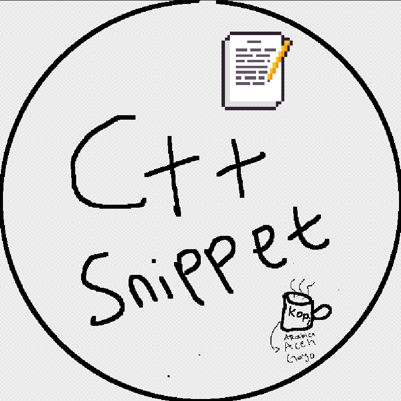

# Code Snippet CPP

# Features

This extension provides snippets for:

- Fast Input Output
- Competitive Programming Template
- Vector
- Pair
- Loop
- Debug Macro
- Typedef
- Sorting
- Binary Search
- Graph
- BFS
- DFS
- Dijkstra
- Segment Tree

---

# How To Use

1. Install the extension
2. Open a `.cpp` file
3. Type the snippet prefix
4. Press:

```txt
Ctrl + Space
```

or press:

```txt
Tab
```

---

# Snippet List

## 1. Basic C++ Template

### Prefix

```txt
cppstartbasic
```

### Function

Create a basic C++ program template.

### Output

```cpp
#include <iostream>
using namespace std;

int main() {

    return 0;
}
```

---

# 2. Fast IO

### Prefix

```txt
cppfastio
```

### Function

Enable fast input output for faster execution when reading large data.

### Output

```cpp
ios::sync_with_stdio(false);
cin.tie(nullptr);
```

---

# 3. Competitive Programming Template

### Prefix

```txt
cppcp
```

### Function

Create a complete Competitive Programming template with:
- typedef
- macro
- fast io

---

# 4. Vector

### Prefix

```txt
cppvector
```

### Function

Create a C++ vector.

### Output

```cpp
vector<int> v;
```

---

# 5. Pair

### Prefix

```txt
cpppair
```

### Function

Create a pair.

### Output

```cpp
pair<int, int> p;
```

---

# 6. For Loop

### Prefix

```txt
cppfor
```

### Function

Create a for loop.

### Output

```cpp
for (int i = 0; i < n; i++) {

}
```

---

# 7. Reverse For Loop

### Prefix

```txt
cpprfor
```

### Function

Reverse loop.

---

# 8. While Loop

### Prefix

```txt
cppwhile
```

### Function

Create a while loop.

---

# 9. Debug Macro

### Prefix

```txt
cppdebug
```

### Function

Display debug variables quickly.

### Output

```cpp
#define debug(x) cout << #x << " = " << x << endl;
```

---

# 10. Typedef

### Prefix

```txt
cpptypedef
```

### Function

Shortcut for common Competitive Programming data types.

### Output

```cpp
using ll = long long;
using pii = pair<int, int>;
```

---

# 11. Sorting

### Prefix

```txt
cppsort
```

### Function

Ascending sort.

### Output

```cpp
sort(v.begin(), v.end());
```

---

# 12. Binary Search

### Prefix

```txt
cppbinary
```

### Function

Binary search template.

---

# 13. Graph

### Prefix

```txt
cppgraph
```

### Function

Graph adjacency list template.

---

# 14. BFS

### Prefix

```txt
cppbfs
```

### Function

Breadth First Search template.

---

# 15. DFS

### Prefix

```txt
cppdfs
```

### Function

Recursive Depth First Search template.

---

# 16. Dijkstra

### Prefix

```txt
cppdijkstra
```

### Function

Dijkstra shortest path template.

---

# 17. Segment Tree

### Prefix

```txt
cppsegtree
```

### Function

Segment Tree template for:
- range query
- point update

---

# Requirements

No additional configuration required.

---

# Known Issues

No known issues yet.

---

# Release Notes

## 1.0.0

- Initial Release
- Added Competitive Programming snippets
- Added Graph snippets
- Added Segment Tree snippet

---

# How To Test The Extension

1. Press `F5`
2. Open a `.cpp` file
3. Type a snippet
4. Press `Ctrl + Space`

Example:

```txt
cppcp
```

---

# Marketplace Keywords

- cpp
- c++
- competitive programming
- snippets
- algorithm
- data structure

---
